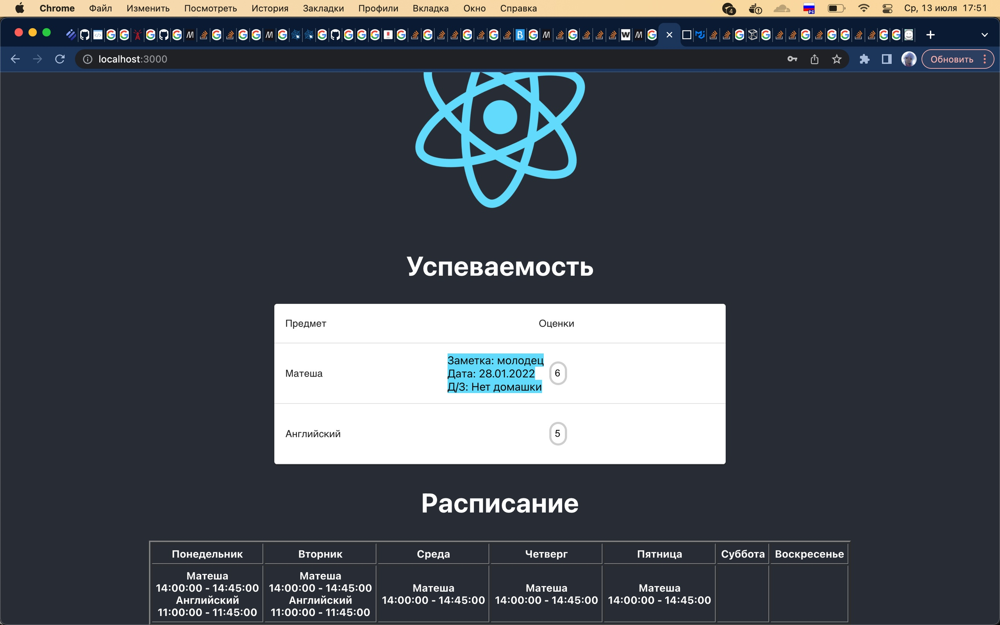

# Система учета успеваемости учащегося MySchool

В этом репозитории лежит исходный код к системе учета успеваемости. Это как "электронный дневник", но помимо отображения оценок учащегося по каждому предмету, домашних заданий и расписания, выводится учебная статистика (средний балл по предмету, общая успеваемость, сравнение по предметам и т.д.). В том числе и у преподавателей (быстрое создание типизированных документов, например, Excel файла с оценками учеников в определенный период).

Разработка еще идет: пока имеется возможность просмотреть оценки ученика и расписание.

Стек: React/JS, jQuery, Java 11, Spring Boot, Postgres.
